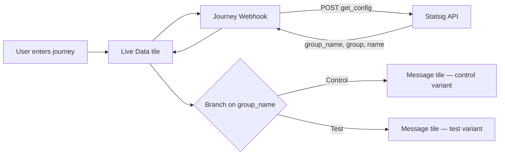
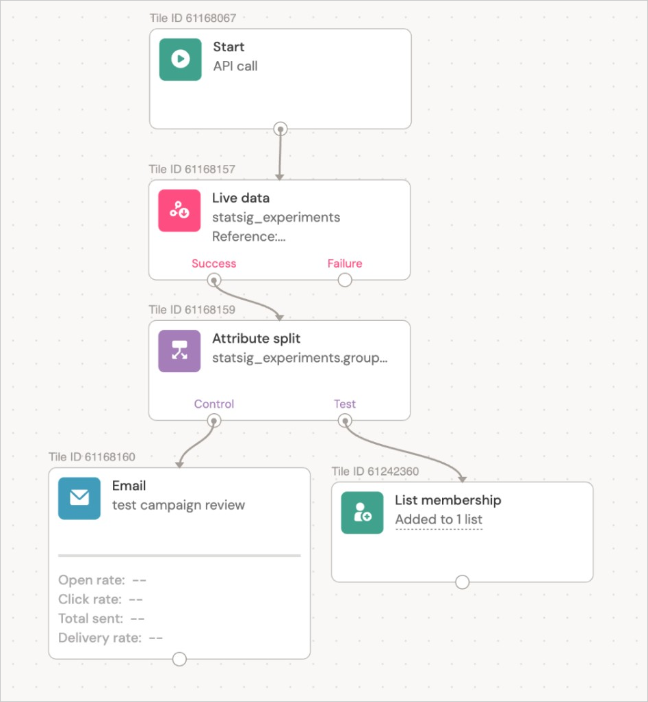
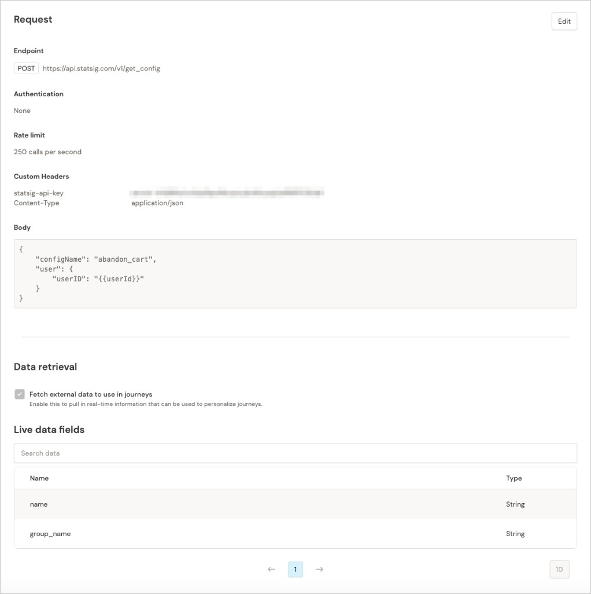
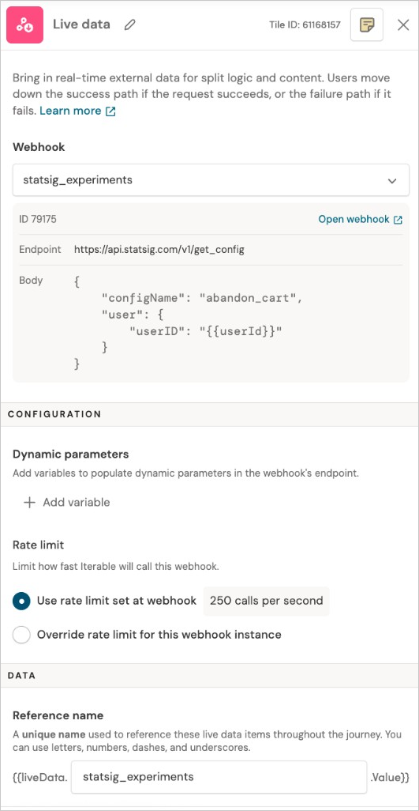
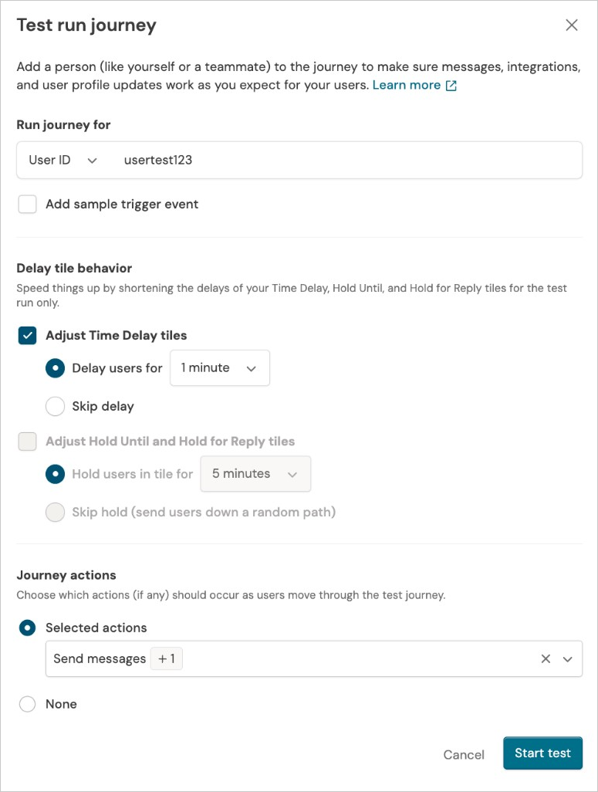

# Real-time Experiment Assignment: Journey Live Data + Statsig

> **Reference example only** — one SA team's pattern for Journey Live Data + Statsig. Other solutions will use different Iterable features; see [examples/README.md](README.md).

## Purpose

Retrieve live experiment group assignments from Statsig inside an Iterable journey so users are routed to the correct variant at send time — without pre-assigning users or syncing experiment fields from the data warehouse.

**When to recommend:**
- Runs A/B tests or feature flags in **Statsig** (or similar experiment platform)
- Uses Iterable **Journeys** to send different messages to control vs. test groups
- Has seen **stale assignments** because experiment group is synced from the data warehouse to Iterable as a user field on a batch schedule
- Wants real-time routing and personalization based on current experiment membership

**Iterable prerequisites:**
- **Journey Webhooks** — must be created first (Integrations → Journey Webhooks)
- **Live Data tile** — added to the journey after the webhook exists; when configuring the tile, select the webhook you created in the step above

## Problem

The typical pattern is to pre-assign users in Statsig, sync the assignment to a data warehouse, and load it into Iterable as a user field. Journeys then branch on that field to send control vs. test variants.

> **Note:** Campaigns do not support branching on experiment assignment — this pattern applies to **Journeys only**.

This breaks when a user's experiment assignment changes after the last sync — for example, due to activity or behavior while they are mid-journey. The user may have moved from control to test (or vice versa), but Iterable still sees the old field value and sends the wrong variant. This undermines both personalization and experiment validity.

## Solution

Use a **Journey Live Data** tile backed by a **Journey Webhook** that calls Statsig's `get_config` API at journey runtime. The webhook response exposes fields like `group_name` for branching tiles and Handlebars personalization in message tiles.

**Benefits:**
- No pre-assignment of users to experiments in a warehouse
- No middleware between Statsig and Iterable
- No additional user profile fields or schema bloat

## Architecture

Assignment is evaluated **at the moment the user hits the Live Data tile**, not from a cached user field synced from the warehouse.




> Guru does not render Mermaid — upload `images/architecture-flowchart-bordered.png` in the card editor. Source: `architecture.mmd` in this folder.

**Branching options** (after Live Data tile):
- **Attribute split** *(recommended)* — branch directly on the Live Data `group_name` field in one tile; fewer steps
- **Filter yes/no** — reference Live Data fields in each filter tile. Example pattern:
  1. First filter: `group_name` **is** `Control` → yes path sends control message
  2. No path → second filter: `group_name` **is** `Test` → yes path sends test message
  3. No path → exit journey, hold, or other handling for users not in either group

Do not try to check Control and Test in a single filter yes/no tile — chain filters on the no path instead.

**Setup order:** Journey Webhook (Integrations) → Live Data tile (journey canvas) → branching tile → Message tiles.

## Implementation

### 1. Get Statsig server secret

In Statsig: **Settings → Keys & Environment** → create or copy the **Server Secret Key** (`secret-...`).

### 2. Create Journey Webhook in Iterable

**Integrations → Journey Webhooks →** create webhook.

**Request**
| Setting | Value |
|---------|-------|
| Destination | Custom |
| Method | POST |
| Endpoint | `https://api.statsig.com/v1/get_config` |
| Authentication | None |
| Rate limit | 250 calls/second (recommended) |

**Custom headers**

| Name | Value |
|------|-------|
| `statsig-api-key` | `YOUR-SECRET-KEY` |
| `Content-Type` | `application/json` |

**Body (JSON)**

```json
{
  "configName": "your_experiment_id",
  "user": {
    "userID": "{{userId}}"
  }
}
```

> `configName` must match the **Experiment ID** in Statsig exactly.  
> The JSON key must be `userID` (Statsig) while the Iterable merge field is `{{userId}}`.

Uncheck **"Include all triggering event fields and workflowId"**.

**Data retrieval**
- Enable **"Fetch external data to use journeys"**
- Select Live Data fields to expose (e.g., `name`, `group_name`)
- **Run Test** with a real `userId` before saving; expect a response like:

```json
{
  "name": "your_experiment_id",
  "value": { "active": false },
  "group": "<group_id>",
  "rule_id": "<rule_id>",
  "group_name": "Test"
}
```

Restore `userId` to `{{userId}}` after testing.

### 3. Add Live Data tile to journey

1. Create or open a journey and add a **Live Data** tile after the journey entry (or at the point assignment must be fresh).
2. In the tile config, **select the Journey Webhook** you created in step 2.
3. Branch on `group_name` to route Control vs. Test:
   - **Attribute split** *(recommended)* — add one tile, split on the Live Data `group_name` field
   - **Filter yes/no** — chain filter tiles using Live Data `group_name`:
     - Filter 1: `group_name` is `Control` → control message path
     - No path → Filter 2: `group_name` is `Test` → test message path
     - No path → exit journey or alternate handling
4. Connect **Message** tiles per branch; use Live Data fields in Handlebars where needed.

## Testing

1. Open the journey → **Test Journey**.
2. Enter a `userId` that **exists in Iterable** — Statsig assigns the experiment group when the user hits the Live Data tile; the user does not need to be pre-assigned in Statsig.
3. Confirm the Live Data tile returns a `group_name` value.
4. Verify branching sends the correct path and message variant (attribute split or filter yes/no chain).

## Example journey

Screenshots from one reference implementation (uses attribute split). When publishing to Guru, upload these images directly in the card editor (markdown links are not imported on paste).

> **Guru publish:** upload all `*-bordered.png` files from `images/`.

### Journey canvas

Example using **attribute split**: Start → Live Data (`statsig_experiments`) → Attribute split on `group_name` → Control (Email) / Test (List membership). A filter yes/no approach chains separate filters on the Live Data `group_name` field (Control → Test → exit).



### Journey Webhook — Request config

Webhook request setup: Statsig `get_config` endpoint, `statsig-api-key` header, JSON body with `configName`, `userID: "{{userId}}"`, and Live Data fields (`name`, `group_name`) selected under Data retrieval.



### Live Data tile config

Live Data tile with the `statsig_experiments` webhook selected. Reference name `statsig_experiments` is used to access response fields in downstream tiles.



### Test Journey

Test Journey modal with a sample `userId` entered before starting the test run.



## Gotchas and limitations

- **`configName` mismatch** — most common failure; value must equal the Statsig Experiment ID, not the display name.
- **Header name** — use `statsig-api-key` (not Bearer auth); Statsig expects the secret in this header.
- **Webhook before tile** — the Journey Webhook must exist before you can select it in the Live Data tile.
- **Journeys only** — campaigns cannot branch on live experiment assignment; use attribute split or filter yes/no tiles in Journeys
- **Rate limits** — default webhook rate limit of 250 rps; adjust if journey volume requires it.
- **User ID field name** — Statsig expects the JSON key `userID`; Iterable provides the value via `{{userId}}`. Do not use `userId` as the JSON key.
- **Not a fit when** — assignments are only needed at audience entry and never change mid-journey; batch user fields synced from the warehouse may be sufficient (no related Guru card yet — create when that pattern is documented).

## Related resources

- [Iterable Journey Webhooks docs](https://support.iterable.com/hc/en-us/articles/360035093152-Journey-Webhooks)
- [Statsig get_config API](https://docs.statsig.com/api-reference#get-config)
- Iterable demo project: *(add internal link)*

## Tags

`journeys`, `live-data`, `journey-webhooks`, `experimentation`, `statsig`, `personalization`, `a-b-testing`
